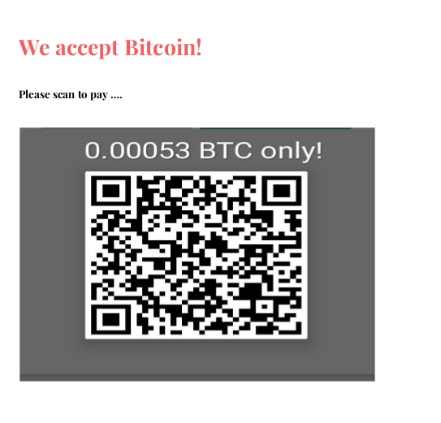

+++
title = "How we failed to sell Orange Cakes for Bitcoins in Spring Fest!"
subtitle = ""
summary = "We tried selling Cakes for Bitcoin and we failed."
date = 2019-03-07T10:00:00+05:30
draft = false
authors = ["Vishwas Anand"]
featured = false
tags = ["fun", "bitcoin", "spring fest", "cook"]
categories = ["General"]
# Featured image
# To use, add an image named `featured.jpg/png` to your page's folder. 
[image]
  # Caption (optional)
  caption = ""

  # Focal point (optional)
  # Options: Smart, Center, TopLeft, Top, TopRight, Left, Right, BottomLeft, Bottom, BottomRight
  focal_point = ""
+++


[Pramati](https://www.pramati.com/) Technology, Chennai had organized **Cook N' Sell Standoff Fest** where teams had to prepare a dish and put a stall at the  venue to sell it. Although I was not interested in the beginning, my friend wanted to participate and she managed to convenience me as her sales guy to sell the freshly baked **Orange Cakes**. She thinks that she is not very social with people and since I am good at talking, I can sell (I was about to prove her wrong :D).To be honest, I was still in a mode of not taking part since I was thinking, why to participate? I have not prepared anything. I do not know how to cook and moreover beside this, being a tech guy, I even do not know how to sell a product. Anyways, a night before the event, she *WhatsApped* me, *Cakes are baked, be prepared to sell them. I want my money back :)*. Though with a smiley, the last line was a bit scary.

## Event day

Since morning a lot of thoughts were coming into my mind. What I will do? How can I sell a product? How that cake will be different from others? What I will tell to the buyers if they ask why should I buy your cake? and many more. I knew I was making a big deal out of it by over thinking, it is just an office fest where all I have to do is stand and smile at known faces, they will buy anyway. But because the role of the sales guy was given to a tech guy, I wanted to take it as a challenge and asked myself "Who will tell me, how to sell a product?" - Of course, the expected answer was Google.

### Morning, 8:30AM

I opened youtube and typed my query in the search box, I watched a video where a guy was selling a pen. He concluded the talk by saying - *Facts tell, story sell!*. He also mentioned that whenever a product sells, it is not just the product which gets sell, *emotions* also get sell with it. I have to figure out a *story* with *emotion* but do not have any. I wanted to do something different than others. Not just stand at the stall and wait for people to taste the cake to buy. Our stall has to have something which attracts people, but we do not have time either. I looked at my watch and it was already half past 9. I have to get ready and rush to the office, I thought.

### Morning, 10:00AM

I usually take my bicycle to the office. It's around 1 and a half KM from my apartment. Though I was getting late, I decided to walk this time, thinking I will buy some time for planning while walking. I left my house and like every other day in Chennai, it was extremely hot out there. I was slowly walking on those pavements (they are very few in that area) while thinking what to do. All of a sudden, I realized that I have to buy some chocolates (being sweets addict, I need some sweet dishes post lunch, daily) and I stopped near a small shop and asked for a *Dairy Milk Bar*. When I opened my wallet, all it had was a Rs500 note and I knew the shopkeeper is going to ask for a change. So I asked him if he accepts [UPI](https://en.wikipedia.org/wiki/Unified_Payments_Interface), and that was the moment an idea clicked into my mind.

> How about accepting Bitcoin as one of the modes of payment at our stall?

### Morning, 10:20AM

I reached the office and started thinking about it. Yeah I can do it and it will create a lot of buzzes since Bitcoin itself is a buzz word, I thought. I decided to have 3 modes of payments:

* Cash
* UPI
* Test Bitcoin

To make it a little more interesting, cash and UPI modes of payments will be for those, who wants to pay and for those who do not want to pay, can use the third mode of payment - Pay with the test Bitcoin. This could be the best way to promote and educate people to use cryptocurrency, I thought. Also, if people get to eat something *free of cost* then why not?

Although it's been now close to 10 years since Satoshi had published Bitcoin paper - [*A Peer-to-Peer Electronic Cash System*](https://bitcoin.org/bitcoin.pdf), many people still do not know how to use cryptocurrency and especially in India, they hesitate to even talk about it since the government has not given clearance on sales of cryptocurrency in the country (sooner or later they will, [sources](https://economictimes.indiatimes.com/news/economy/policy/will-modi-government-kill-bitcoin-for-its-own-lakshmi/articleshow/62833957.cms) said they themselves working on Lakshmi Coin). My first job was to educate the office folks to use Bitcoin in the test network. I noticed that I still have 1 hour left, all I have to do is write down the steps of using test bitcoin and post it on the Loop - Its a social networking app for Pramati's employees.

So I made the following post (sharing here as well for those who do not know how to use test Bitcoin wallet):

```
Hey Guys,   
ORANGE CAKE FOR FREE! FREE! FREE!  
We are selling "Orange Cake" in "Cook N' Sell Standoff Fest" and one the mode of payment is going to be Bitcoin (test BTC of course), just to get the experience of cryptocurrency payment. 
For those who want to experience this mode of payment, here are the simple guidelines:  
1. Download "Bitcoin Wallet for Testnet" from the play store (https://play.google.com/store/apps/details?id=de.schildbach.wallet_test&hl=en‎). 
2. Open it and you see your wallet with 0 BTC, so you need test BTC to spend, all you have to do is, click on the QR on the top right - in the popup - you will see your public key (a account Id)      
  
  2.1 Go to Coinfaucet.eu(https://coinfaucet.eu/en/btc-testnet/‎) and paste the accountId in the text box.      
  2.2 Press the button, "Get the Bitcoin" and you are done. After some time, you will notice test BTC in your account which is worth of ~30K.  
Now you can come to our stall, scan the QR and pay for the cake, that too free of cost (the test BTC is not going to cost any money) :D
```

### Morning, 11:30AM

The show was going to start at 12PM, I still have 30 mins left. I thought of giving the recipe and nutrition facts of the cake to the buyers so that they will know what was going on behind the scene and what are they consuming (The thought of transparency always come into my mind since when I had started working on Blockchain tech, sorry cannot help with that :D). Asked my friend to send me the recipe and nutrition facts and prepared some leaflets. The next and final thing was to decide the cost of the cake. Not in the rupee, she had already decided - its Rs20, but in Bitcoin. You must be thinking why not simply convert Rs20 to BTC? Here is the thing - If we directly convert Rs20 to BTC then it would be around, 0.000074BTC (as per the current rate)but the minimum network fee itself is around 0.000090BTC, which is more than the cost of a cake itself, so it won't make sense to the spender. And if you try to make payment (which you can certainly do) with Bitcoin wallet, you will get warning message something like this:


Then how people are doing micropayments with Bitcoin? I heard about a cafe accepting Bitcoin for coffee in the US. Then I realized that the cost of coffee itself is $5 there, so it makes sense. Even in India, if Starbuck wants, can do it since the cost of coffee there is around Rs350 - I hate Starbuck for this, you can not sell such a bad coffee (I wanted to write "shitty") for that amount. I wish to make Starbuck's owner consume Chennai's special filtered coffee sometime. Sorry, got carried away in my emotions.

It is very difficult to design an economic model for even a small module of an application. I learned this when my team was working on a POC of media streaming on Blockchain where we had to design a simple economic model. One way could be, randomly decide a figure and release the product - then see the market behavior towards that product and slightly shift the figures up or down (I forgot the name of this model). I decided to go $2 for a piece of cake which translates to 0.00053BTC.

### The show begins!


My friend decorated the table - the so-called stall, it was our canteen and we didn't have much to decorate excepts few pamphlets, which I stuck to the water bottles - and we waited for the crowd to come. Trust me the cake was smelling so nice that I wanted to grab a piece the moment I saw it, but could not.

A guy came and he liked the cake very much (as I was expecting) and when the time came for payment, I purposefully asked, *Dude, would to like to try Bitcoin mode? - It's free!*. The first reaction - his blank face - I understood he didn't have gone through my Loop post. And then he opted for cash. Likewise, we sold all the pieces but nobody was interested in Bitcoin mode of payment. Big shout to one of them, Akhil, who actually downloaded the Bitcoin wallet and got some test BTC from the faucet - enough for my happiness!


## What went wrong?

* Bitcoin payment is very slow. I mean very very slow. Once you paid it will take years for the confirmation (not literally).
* It may be good for the payment of a large amount, but for the micropayment? - I do not think so.
* The transaction fee is very high.
* People are still not aware of cryptocurrency. Many people think it as share.
* This event might not be the right place for this kind of experiment (let me know your thoughts in the comment).
* Lastly, never ever ask a tech guy to sell a product, otherwise, you end up with all these :)



## Conclusion


Though I failed to sell cakes for Bitcoin, I was happy, cause my friend, Parvathi was happy since she was able to see all her cakes and was able to earn some money too (by the way that money went to charity).

> I want to thank Parvathi Somasundren for giving me the opportunity to work with her in this event. She was very helpful to me for taking any decision which I wanted to take (even if these things were out of her interest)


This blog was previously posted on [Medium](https://medium.com/@vishwasbanand/how-we-failed-to-sell-orange-cakes-for-bitcoins-during-spring-fest-d13620e496a)


